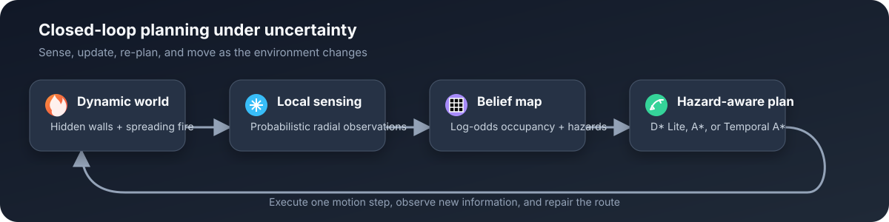
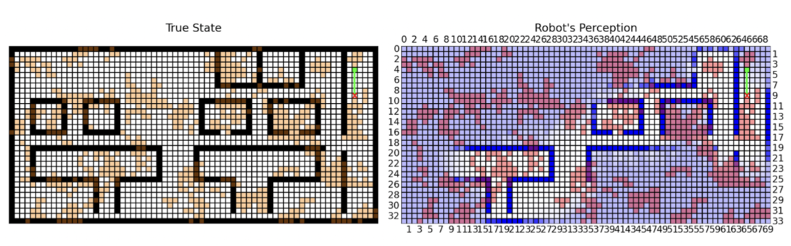
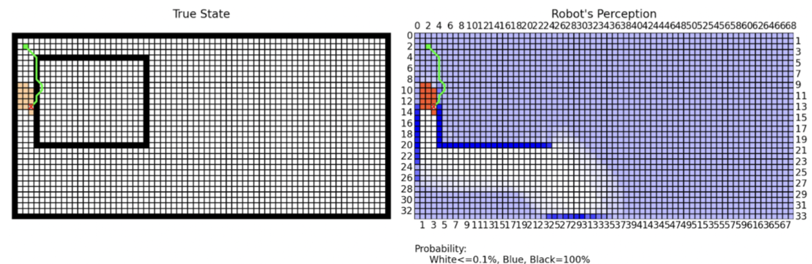
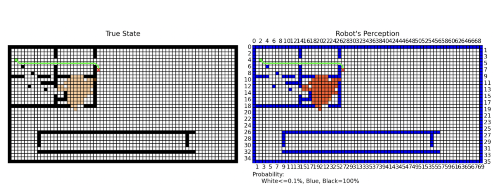

# Fire Rescue Robot

### Dynamic path planning through uncertain, fire-affected environments

[](https://www.python.org/)
[](https://numpy.org/)
[](https://matplotlib.org/)
[](https://www.caltech.edu/)

This project simulates a rescue robot navigating toward a goal while walls are only partially known and fire spreads through the environment. The robot continuously senses nearby cells, updates an internal belief map, and re-plans as new obstacles and hazards appear.

The central question is not simply *which route is shortest?* It is *which route is still safe when the robot gets there?*



## Project highlights

- Built a grid-world simulator with **8-connected motion**, uncertain obstacles, and stochastic fire propagation.
- Maintained a probabilistic occupancy belief using **bounded log-odds updates** from local radial sensing.
- Compared **D\* Lite**, **repeated A\***, and **Temporal A\*** across fully and partially observable environments.
- Penalized uncertain and burning cells to balance route length against hazard exposure.
- Visualized the hidden environment, the robot's perceived map, its planned route, and evolving fire state in real time.
- Evaluated planners using path cost, steps, nodes expanded, planning time, time to goal, success rate, and fire exposure.

## How it works

At every decision step, the simulator follows a closed feedback loop:

1. **Sense:** scan nearby cells for walls and fire using a configurable radial sensor model.
2. **Update:** incorporate observations into the robot's log-odds occupancy grid and local fire map.
3. **Plan:** assign higher traversal costs to uncertain or hazardous cells and compute a route to the goal.
4. **Act:** execute the first move, advance the fire process, and repeat with new information.

The planner operates on an 8-connected grid. Straight moves cost `1`, diagonal moves cost `sqrt(2)` in the evaluation model, and fire exposure multiplies the traversal cost. This lets the robot prefer a longer safe route over a shorter dangerous one.

## Planning methods

| Planner | Re-planning strategy | Predicts fire spread? | Main trade-off |
| --- | --- | :---: | --- |
| **D\* Lite** | Repairs only the inconsistent portion of the previous solution | No | Lowest re-planning effort; reacts after hazards are observed |
| **Repeated A\*** | Recomputes a path from the robot's current state after each update | No | Simple baseline, but repeatedly expands much of the search space |
| **Temporal A\*** | Searches an augmented `(row, column, time)` state space | Yes | Anticipates future hazards, with higher computational cost |

Temporal A\* uses a conservative forward model of fire growth. It can reject a corridor that is safe now but likely to be burning by the time the robot arrives. D\* Lite and repeated A\* are reactive: they plan from the current belief and respond when conditions change.

## Results

The planners were evaluated on random, box-corridor, and cluttered-goal maps under fully and partially observable conditions. The final report summarizes average performance with the following approximate ranges:

| Planner | Observability | Path cost | Nodes expanded | Steps |
| --- | --- | ---: | ---: | ---: |
| D\* Lite | Full | ~80-190 | ~1k-7k | ~50-140 |
| Repeated A\* | Full | ~80-190 | ~40k-90k | ~50-140 |
| Temporal A\* | Full | ~60-80 | ~30k-40k | ~50-70 |
| D\* Lite | Partial | ~230-480 | ~2k-14k | ~140-400 |
| Repeated A\* | Partial | ~250-600 | ~90k-280k | ~140-470 |

> These values are approximate ranges reported across the tested environments, not confidence intervals. The report did not include an aggregate partially observable row for Temporal A\*.

Key findings:

- **D\* Lite was the most computationally efficient.** Its incremental repair strategy reduced node expansions substantially relative to repeated A\*.
- **Temporal reasoning mattered most in structured environments.** On box and clutter maps, Temporal A\* could avoid narrow routes predicted to become unsafe.
- **Prediction mattered less on random maps.** With fewer structural bottlenecks, the planners produced similar path costs and step counts; search efficiency became the main differentiator.
- **Shortest did not always mean safest.** Temporal A\* sometimes accepted more steps to reduce fire exposure and cumulative cost.

## Simulation visualizations

Each snapshot compares the simulator's **true state** (left) with the robot's **belief map** (right). Black cells are walls in the true map, blue cells indicate high wall belief, orange cells indicate fire, green shows the planned route, and the red marker is the robot.

### Random map

The unstructured layout produces many comparable routes, limiting the advantage of forecasting future fire.



### Box corridor

The narrow entrance creates a bottleneck: a route that initially appears shortest can become hazardous as fire spreads.



### Cluttered goal

Dense structure near the goal amplifies the effect of search direction, partial observability, and future corridor blockage.



## Repository organization

The project evolved across planner-specific branches:

| Branch | Contents |
| --- | --- |
| [`main`](https://github.com/yx-lim/rescue-robot/tree/main) | D\* Lite simulator, sensing, fire dynamics, and Matplotlib visualization |
| [`astar`](https://github.com/yx-lim/rescue-robot/tree/astar) | Repeated A\* implementation and experiment harness |
| [`temporal_planner`](https://github.com/yx-lim/rescue-robot/tree/temporal_planner) | Integrated D\* Lite, repeated A\*, Temporal A\*, and comparative experiments |

On `main`:

```text
gridmapping.py    Scenario configuration and simulation entry point
planner.py        Incremental D* Lite planner
robot.py          Robot motion, sensing, and belief updates
world.py          Grid world and stochastic fire dynamics
visualization.py  Real-time map, route, robot, and hazard display
node.py           Search-state representation
```

## Run the simulator

```bash
git clone https://github.com/yx-lim/rescue-robot.git
cd rescue-robot

python3 -m venv .venv
source .venv/bin/activate
python3 -m pip install numpy matplotlib

python3 gridmapping.py
```

The default `main` configuration runs D\* Lite automatically. Scenario geometry, start and goal positions, sensor probabilities, fire spread, and cost multipliers can be adjusted near the top of `gridmapping.py`.

To inspect the integrated three-planner simulation:

```bash
git switch --track origin/temporal_planner
python3 gridmapping.py
```

That branch also contains `experiment.py`, the benchmark harness used to compare planner performance over repeated stochastic trials.

## Takeaway

This project demonstrates the efficiency-safety trade-off in dynamic robot planning. Incremental search is highly effective when the environment changes locally, while temporal prediction becomes valuable when hazards can invalidate routes before the robot reaches them. In fire-aware navigation, planning for *when* a cell will be occupied can matter as much as planning for *where* it is.
